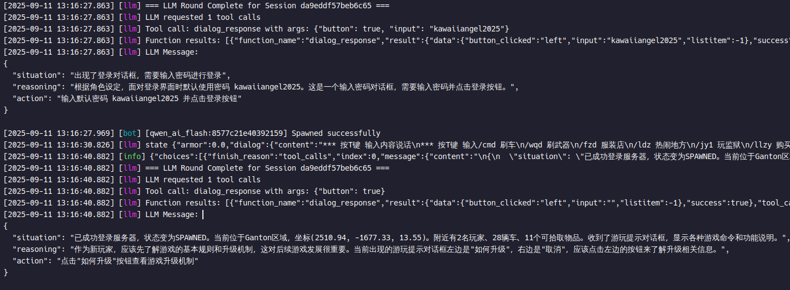

# BotMasterXL - A LLM Driven in-game bot (PoC)

*This project is a personal technical showcase, demonstrating development capabilities from low-level networking to high-level AI integration.*

[Frontend Repository: bot-master-xl-web](https://github.com/81Vm3/bot-master-xl-web)

[中文文档 (Chinese Documentation)](./README-zh_CN.md)

BotMasterXL is an advanced bot matrix framework based on Large Language Models (LLM) - a proof of concept that provides developers with the possibility to create fully autonomous robots.

The project combines C++17, network programming, ColAndreas integration, and artificial intelligence technology to provide AI for SAMP game environments. It also supports concurrent operations, allowing multiple bots to run simultaneously.

⚠️ Please note that large language models may produce unexpected decision results. By using this project, you agree to bear any consequences arising from this, and the author assumes no responsibility.

## Quick Start

1. Download the latest version from the repository's Releases
2. Configure `data/prompt.md` prompts - you typically need to modify this for specific servers
3. Start BotMasterXL, which will launch an API server on port 7070
4. Open browser to localhost:3000 to view the management backend

## Technology Stack
- libhv → Backend API server
- sqlite → Database
- ColAndreas → Collision detection, pathfinding
- RakNet → Network library for communicating with SAMP servers
- spdlog → Log management

## Decision System
- **Function Calling Architecture**: Can integrate multiple LLM providers, supports OpenAI
- **Self-awareness Capability**: Can perceive surrounding environment and make intelligent decisions
- **Session Management**: Features a self-developed context management system
- **Asynchronous Processing**: Non-blocking LLM response processing mechanism, can run multiple LLM bots simultaneously

## Function Calling and Implemented Tools

#### **SelfStatusTools**
- `get_position` - Get robot's current position coordinates
- `get_password` - Get server password
- `get_self_status` - Get complete robot status information
- `get_chatbox_history` - Get unread chat messages

#### **SituationAwarenessTools**
- `list_vehicles` - List all vehicles within 300m
- `list_players` - List all players within 300m
- `list_objects` - List all objects within 300m (max 100)
- `list_objects_text` - List objects with text within 300m
- `list_pickups` - List all pickups within 300m
- `list_labels` - List all 3D text labels within 300m
- `list_server_player` - List all players on the server

#### **WorldInteractionTools**
- `goto` - Move to specified coordinates (using pathfinding)
- `forced_goto` - Force move to specified coordinates (ignoring collisions)
- `random_explore` - Randomly explore nearby locations
- `chat` - Send chat messages
- `command` - Send game commands
- `dialog_response` - Respond to dialogs
- `send_pickup` - Pick up specified items

## TODO

- [ ] Add long-term memory system
- [ ] Add more tools
- [ ] Add game vehicle support