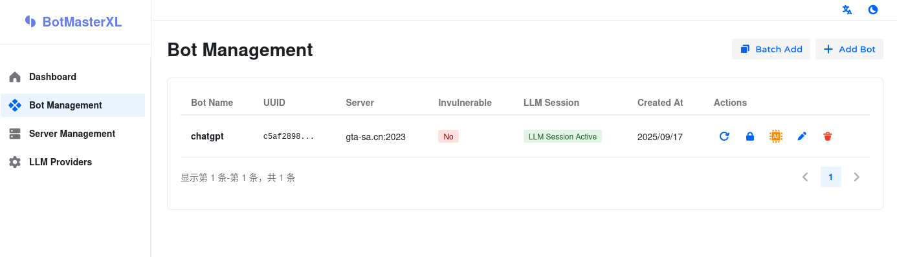

    简体中文 (Chinese)
    |
    <a href="./README_EN.md">English</a>

 

*如果觉得对您有帮助或者对该产品感兴趣，请您给点一个 Star，谢谢！*

# BotMasterXL

> BotMasterXL 是一款针对SA-MP开源的LLM Bot矩阵框架
>
> [→ 前端仓库](https://github.com/81Vm3/bot-master-xl-web)
>

## 概览

BotMasterXL是一个基于大语言模型(LLM)的高级Bot矩阵框架 (Proof of concept)，为开发者提供创建完全自主机器人的可能

项目结合C++17、网络编程、集成ColAndreas和人工智能技术，为SAMP环境提供AI。同时支持并发操作，允许同时多开多个bot

⚠️ 请注意，大模型可能产生意外的决策结果。使用本项目即表示您同意，自行承担因此产生的任何后果，作者不承担任何责任。

## 快速开始

### 部署

1. 下载本仓库Release的最新版本
2. 添加ColAndreas文件 (可选)，用于检测地图碰撞，放入 `data/ColAndreas.cadb`
3. 启动BotMasterXL
4. 打开浏览器 http://localhost:7070/web 查看主页

### 添加Bot

要添加bot, 首先需要在管理面板中添加服务器

添加服务器后，前往bot页面，新建bot。

bot的密码用于处理服务器登录或注册。为可选项，如果填写密码将会把密码传给LLM

### 提示词

默认的系统提示词文件在本地文件 `data/prompt.md` 中，为中文提示词。

其他语言的提示词需要自行翻译

如果你希望精细化个别bot的行为，前往bot控制台调整提示词即可 (bot的提示词和 `data/prompt.md` 是两个不同的提示词，并同时发挥作用)

## 决策系统

- **函数调用(Function Calling)架构**: 可集成多种LLM提供商，支持OpenAI
- **自感知能力**: 可以感知周围环境并作出智能决策
- **会话管理**: 具有一套自主开发的上下文管理系统
- **异步处理**: 非阻塞的LLM响应处理机制，可以同时开启多个LLM Bot
- **服务器管理**: 集成SA-MP服务器信息管理

## 编译

已测试过的编译环境:

1. Debian Bookworm x64 g++
2. x86_64-w64-mingw32-g++-posix 跨平台编译

尚未在Windows平台下测试过编译，如感兴趣请自行测试

## 反馈

目前该项目仍处于起步阶段 (bleeding-edge)，不建议长期使用

问题反馈至issue tracker。请注意，只接受与本项目有关的问题，由SAMP服务器造成的问题不在处理问题内，

## 函数调用以及已实现的Tool

#### **SelfStatusTools (自身状态工具)**
- `get_position` - 获取机器人当前位置坐标
- `get_password` - 获取服务器密码
- `get_self_status` - 获取完整的机器人状态信息
- `get_chatbox_history` - 获取未读聊天消息

#### **SituationAwarenessTools (环境感知工具)**
- `list_vehicles` - 列出300m内所有载具
- `list_players` - 列出300m内所有玩家
- `list_objects` - 列出300m内所有物体(最多100个)
- `list_objects_text` - 列出300m内带文字的物体
- `list_pickups` - 列出300m内所有拾取物
- `list_labels` - 列出300m内所有3D文字标签
- `list_server_player` - 列出服务器内所有玩家

#### **WorldInteractionTools (世界交互工具)**
- `goto` - 移动到指定坐标(使用路径寻找)
- `forced_goto` - 强制移动到指定坐标(忽略碰撞)
- `random_explore` - 随机探索附近位置
- `chat` - 发送聊天消息
- `command` - 发送游戏命令
- `dialog_response` - 响应对话框
- `send_pickup` - 拾取指定物品

## 待完成

- [ ] 添加长期记忆系统
- [ ] 添加更多tool
- [ ] 添加游戏载具支持