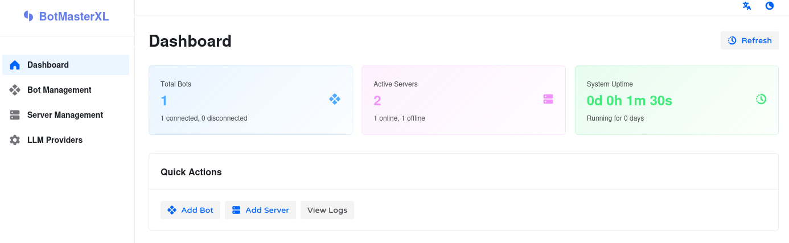
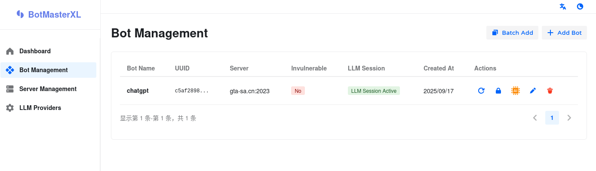

    <a href="./README.md">简体中文 (Chinese)</a>
    |
    English

 

*If you find this helpful or are interested in this product, please give it a Star, thank you!*

# BotMasterXL

> BotMasterXL is an open-source LLM Bot matrix framework for SA-MP
>
> [→ Frontend Repository](https://github.com/81Vm3/bot-master-xl-web)
>

## Overview

BotMasterXL is an advanced Bot matrix framework based on Large Language Models (LLM) (Proof of concept), providing developers with the possibility to create fully autonomous robots.

The project combines C++17, network programming, ColAndreas integration, and artificial intelligence technology to provide AI for SAMP environments. It also supports concurrent operations, allowing multiple bots to run simultaneously.

⚠️ Please note that large models may produce unexpected decision results. By using this project, you agree to bear any consequences arising therefrom, and the author assumes no responsibility.

## Quick Start

### Deployment

1. Download the latest version from the repository's Release
2. Add ColAndreas files (optional), for map collision detection, place in `data/ColAndreas.cadb`
3. Start BotMasterXL
4. Open browser at http://localhost:7070/web to view the homepage

### Adding Bots

To add a bot, you first need to add a server in the management panel.

After adding the server, go to the bot page and create a new bot.

The bot's password is used for server login or registration. It's optional, and if filled, the password will be passed to the LLM.

### Prompts

The default system prompt file is in the local file `data/prompt.md`, which is in Chinese.

Prompts in other languages need to be translated manually.

If you want to fine-tune the behavior of individual bots, go to the bot console to adjust the prompts (the bot's prompt and `data/prompt.md` are two different prompts that work simultaneously).

## Decision System

- **Function Calling Architecture**: Can integrate multiple LLM providers, supports OpenAI
- **Self-awareness Capability**: Can perceive surrounding environment and make intelligent decisions
- **Session Management**: Has a self-developed context management system
- **Asynchronous Processing**: Non-blocking LLM response processing mechanism, can run multiple LLM Bots simultaneously
- **Server Management**: Integrated SA-MP server information management

## Compilation

Tested compilation environments:

1. Debian Bookworm x64 g++
2. x86_64-w64-mingw32-g++-posix cross-platform compilation

Compilation has not been tested on Windows platform, please test yourself if interested.

## Feedback

This project is currently in its early stages (bleeding-edge) and is not recommended for long-term use.

Please report issues to the issue tracker. Note that only issues related to this project are accepted; problems caused by SAMP servers are not within the scope of handling.

## Function Calling and Implemented Tools

#### **SelfStatusTools**
- `get_position` - Get robot's current position coordinates
- `get_password` - Get server password
- `get_self_status` - Get complete robot status information
- `get_chatbox_history` - Get unread chat messages

#### **SituationAwarenessTools**
- `list_vehicles` - List all vehicles within 300m
- `list_players` - List all players within 300m
- `list_objects` - List all objects within 300m (max 100)
- `list_objects_text` - List objects with text within 300m
- `list_pickups` - List all pickups within 300m
- `list_labels` - List all 3D text labels within 300m
- `list_server_player` - List all players on the server

#### **WorldInteractionTools**
- `goto` - Move to specified coordinates (using pathfinding)
- `forced_goto` - Force move to specified coordinates (ignoring collisions)
- `random_explore` - Randomly explore nearby locations
- `chat` - Send chat messages
- `command` - Send game commands
- `dialog_response` - Respond to dialogs
- `send_pickup` - Pick up specified items

## TODO

- [ ] Add long-term memory system
- [ ] Add more tools
- [ ] Add game vehicle support